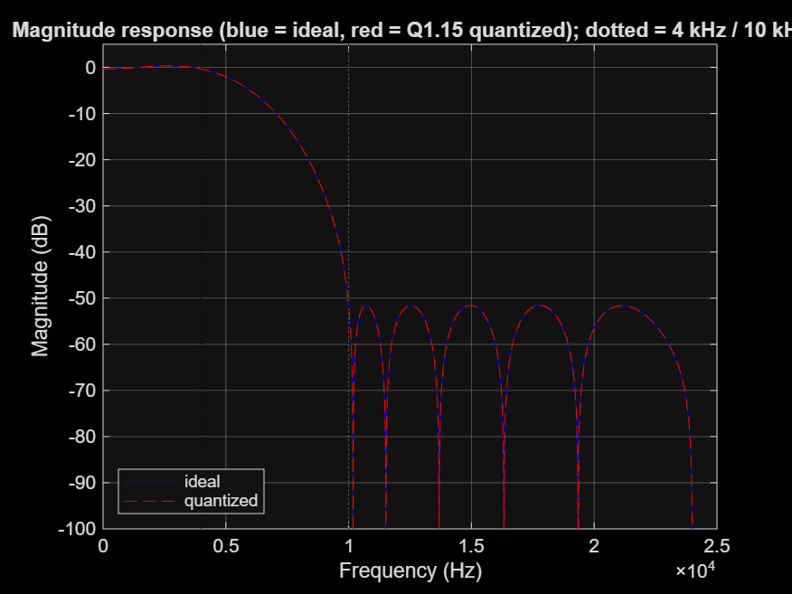
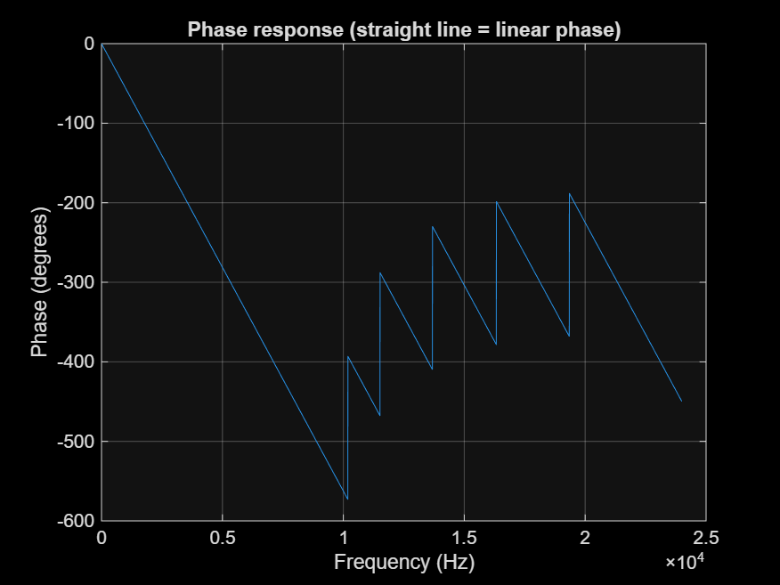
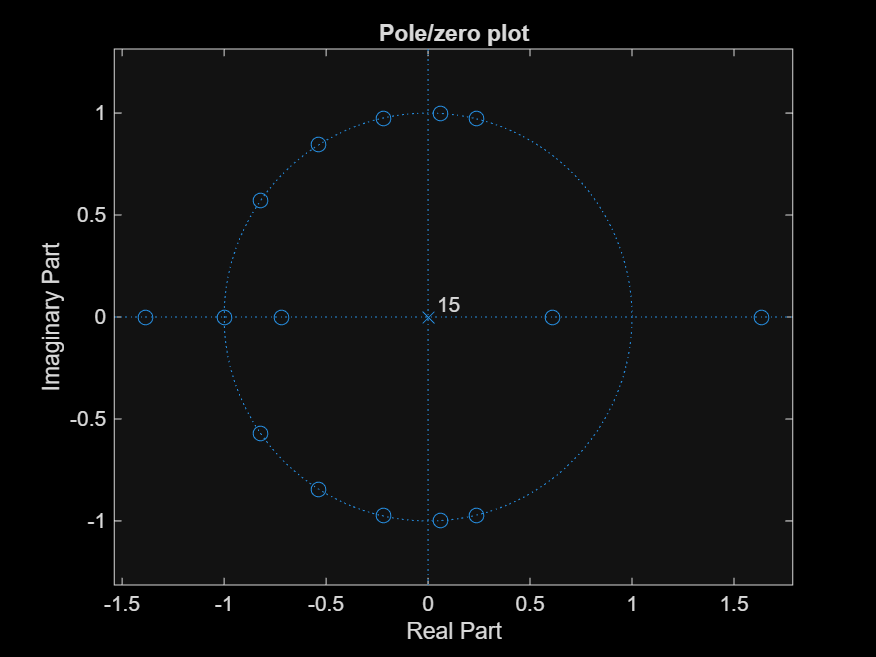
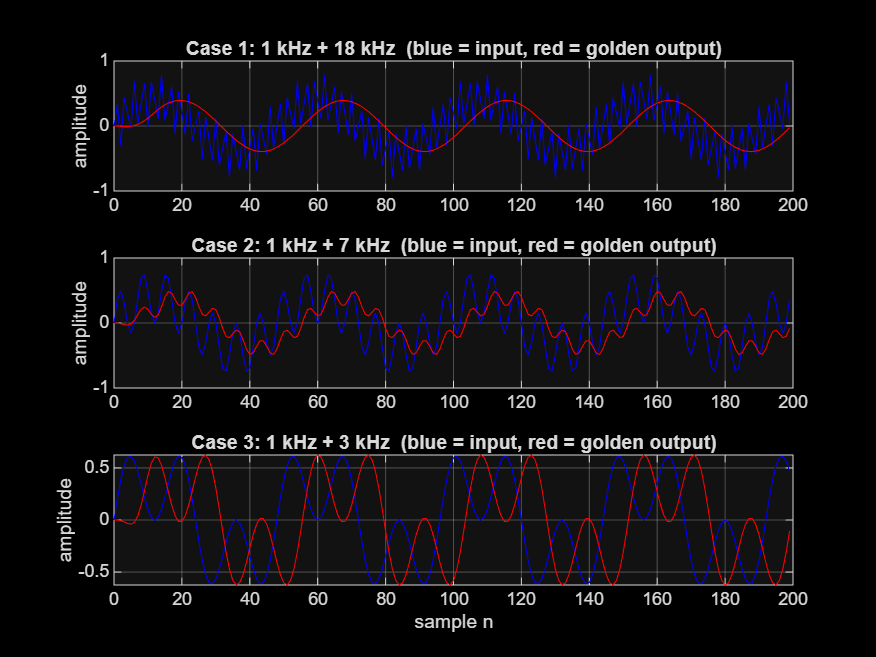

# FIR Filter — MATLAB Design & Verilog RTL Implementation

A 16-tap, direct-form, low-pass FIR filter designed in MATLAB and implemented in synthesisable Verilog.  
The MATLAB script produces quantised coefficients and bit-exact golden outputs; the Verilog testbench runs all three test cases and self-checks against those golden files.

---

## Table of Contents

1. [Project Overview](#project-overview)
2. [Repository Structure](#repository-structure)
3. [Filter Specifications](#filter-specifications)
4. [Workflow](#workflow)
5. [MATLAB — Design & Golden Model](#matlab--design--golden-model)
6. [Verilog RTL](#verilog-rtl)
7. [Simulation](#simulation)
8. [Test Cases](#test-cases)
9. [Filter Plots](#filter-plots)
10. [Fixed-Point Format (Q1.15)](#fixed-point-format-q115)

---

## Project Overview

| Item | Value |
|------|-------|
| Filter type | Linear-phase FIR (Parks–McClellan / equiripple) |
| Number of taps | 16 |
| Sampling rate | 48 000 Hz |
| Passband edge | 4 000 Hz |
| Stopband edge | 10 000 Hz |
| Max passband ripple | 1 dB (peak-to-peak) |
| Min stopband attenuation | 50 dB |
| Fixed-point format | Q1.15 (16-bit signed, two's complement) |
| Accumulator width | 36 bits (Q2.30 + 4 guard bits) |

The design flow is:

```
MATLAB script  →  coefficients (Q1.15 hex)  →  Verilog RTL  →  Simulation  →  Pass/Fail
               →  golden output hex files   →  Testbench self-check
```

---

## Repository Structure

```
FIR_filter/
│
├── matlab/
│   ├── ZDC_Fir_design.m        ← Full design script (filter design, quantisation,
│   │                              stimulus generation, golden model, plots)
│   └── fir_localparams.txt     ← Ready-to-paste Verilog localparam lines (Q1.15 hex)
│
├── rtl/
│   └── fir_filter.v            ← Synthesisable 16-tap FIR (direct form, Q1.15)
│
├── sim/
│   ├── fir_filter_tb.v         ← Self-checking testbench (3 cases, golden comparison)
│   └── hex/
│       ├── fir_coeffs.hex          ← 16 quantised coefficients (one per line)
│       ├── stimulus_case1.hex      ← 4800 input samples  – Case 1
│       ├── stimulus_case2.hex      ← 4800 input samples  – Case 2
│       ├── stimulus_case3.hex      ← 4800 input samples  – Case 3
│       ├── golden_case1.hex        ← 4800 expected outputs – Case 1
│       ├── golden_case2.hex        ← 4800 expected outputs – Case 2
│       └── golden_case3.hex        ← 4800 expected outputs – Case 3
│
├── figures/
│   ├── fig_magnitude.png       ← Ideal vs. quantised magnitude response
│   ├── fig_phase.png           ← Phase response (linear phase check)
│   ├── fig_polezero.png        ← Pole-zero plot
│   └── fig_cases.png           ← Input/output waveforms for all 3 cases
│
├── LICENSE
└── README.md
```

---

## Filter Specifications

| Parameter | Value |
|-----------|-------|
| Taps (N) | 16 |
| Filter order | 15 |
| Design method | Parks–McClellan (`firpm`) |
| Passband (0 → fp) | 0 – 4 000 Hz, ripple ≤ 1 dB |
| Transition band | 4 000 – 10 000 Hz |
| Stopband (fst → fs/2) | 10 000 – 24 000 Hz, attenuation ≥ 50 dB |
| Phase | Linear (symmetric coefficients) |

---

## Workflow

```
┌─────────────────────────────────────────────────────────────┐
│  Step 1 – MATLAB: Design                                    │
│  Run ZDC_Fir_design.m                                       │
│  • Designs equiripple FIR with firpm()                      │
│  • Checks passband ripple & stopband attenuation            │
│  • Quantises coefficients to Q1.15                          │
│  • Writes fir_coeffs.hex & fir_localparams.txt              │
└──────────────────────┬──────────────────────────────────────┘
                       │
┌──────────────────────▼──────────────────────────────────────┐
│  Step 2 – MATLAB: Golden Model                              │
│  • Generates 3 test stimuli (1 kHz wanted + interferer)     │
│  • Computes bit-exact golden outputs using integer maths    │
│  • Writes stimulus_caseN.hex & golden_caseN.hex             │
│  • Saves filter plots (figures/)                            │
└──────────────────────┬──────────────────────────────────────┘
                       │
┌──────────────────────▼──────────────────────────────────────┐
│  Step 3 – Verilog RTL                                       │
│  • Paste fir_localparams.txt coefficients into fir_filter.v │
│  • Direct-form FIR: combinational MAC + registered output   │
└──────────────────────┬──────────────────────────────────────┘
                       │
┌──────────────────────▼──────────────────────────────────────┐
│  Step 4 – Simulation                                        │
│  • Testbench loads hex files with $readmemh                 │
│  • Drives one sample per clock, checks every y_out          │
│  • Prints PASS / FAIL per case and total mismatch count     │
└─────────────────────────────────────────────────────────────┘
```

---

## MATLAB — Design & Golden Model

**File:** `matlab/ZDC_Fir_design.m`

### Running the script

Open MATLAB, navigate to the `matlab/` folder, then:

```matlab
cd matlab
run('ZDC_Fir_design.m')
```

> **Note:** The script writes output files to the *current folder*.  
> Afterwards, move or copy any regenerated hex files to `sim/hex/`.

### What the script does

| Section | Description |
|---------|-------------|
| 1. Parameters | Sets fs, tap count, band edges, ripple/attenuation specs |
| 2. Filter design | Calls `firpm()`, sweeps stopband weights until spec is met |
| 3. Quantisation | Rounds coefficients to Q1.15 integers; verifies spec is still met |
| 4. Export | Writes `fir_coeffs.hex` and `fir_localparams.txt` |
| 5. Stimulus & golden | Generates 3 sinusoidal test signals; computes bit-exact outputs |
| 6. Gain check | Prints filter gain (dB) at each test tone |
| 7. Plots | Saves magnitude, phase, pole-zero, and waveform figures |

### Quantised coefficients (Q1.15)

| Index | Hex | Integer |
|-------|-----|---------|
| H0  | `FF3A` | −198   |
| H1  | `FD5C` | −676   |
| H2  | `FBCA` | −1 078 |
| H3  | `FC8E` | −882   |
| H4  | `0244` | +580   |
| H5  | `0CC2` | +3 266 |
| H6  | `18C2` | +6 338 |
| H7  | `20C9` | +8 393 |
| H8  | `20C9` | +8 393 |
| H9  | `18C2` | +6 338 |
| H10 | `0CC2` | +3 266 |
| H11 | `0244` | +580   |
| H12 | `FC8E` | −882   |
| H13 | `FBCA` | −1 078 |
| H14 | `FD5C` | −676   |
| H15 | `FF3A` | −198   |

The coefficients are **symmetric** (H[k] = H[N−1−k]), confirming linear phase.

---

## Verilog RTL

**File:** `rtl/fir_filter.v`

### Module interface

```verilog
module fir_filter (
    input  wire        clk,    // rising-edge clock
    input  wire        rst_n,  // active-low synchronous reset
    input  wire signed [15:0] x_in,   // Q1.15 input sample
    output reg  signed [15:0] y_out   // Q1.15 filtered output (1-cycle latency)
);
```

### Architecture

| Block | Details |
|-------|---------|
| **Delay line** | 15-element shift register `delay_line[14:0]`, shifted every rising edge |
| **Accumulator** | 36-bit signed `acc[35:0]` — holds the full multiply-accumulate sum |
| **MAC** | Combinational; computes `acc = Σ x[n−k] × H[k]` for k = 0…15 |
| **Output** | `y_out ← acc[30:15]` (arithmetic right-shift by 15, registered) |
| **Reset** | Synchronous, active-low; clears delay line and output |

**Timing:** one cycle of latency — `y_out` holds the filtered result for sample `x[n−1]` while `x[n]` is being applied.

---

## Simulation

**File:** `sim/fir_filter_tb.v`

### Prerequisites

- Any Verilog-2001 simulator (ModelSim, Vivado Simulator, Icarus Verilog, etc.)
- Hex files present in `sim/hex/`

### Icarus Verilog

```bash
cd sim
iverilog -o fir_filter_tb.vvp ../rtl/fir_filter.v fir_filter_tb.v
vvp fir_filter_tb.vvp
```

### ModelSim / Questa

```tcl
vlib work
vlog ../rtl/fir_filter.v fir_filter_tb.v
vsim -c fir_filter_tb -do "run -all; quit"
```

### Vivado (Tcl Console)

```tcl
add_files -fileset sim_1 ../rtl/fir_filter.v sim/fir_filter_tb.v
set_property top fir_filter_tb [get_filesets sim_1]
launch_simulation
run all
```

### Expected console output

```
---- Case 1: 1 kHz + 18 kHz (interferer in the STOPBAND, should be removed) ----
Case 1: PASS  (4800 / 4800 samples match the golden model)
---- Case 2: 1 kHz + 7 kHz (interferer in the TRANSITION band, partly reduced) ----
Case 2: PASS  (4800 / 4800 samples match the golden model)
---- Case 3: 1 kHz + 3 kHz (both in the PASSBAND, both should pass) ----
Case 3: PASS  (4800 / 4800 samples match the golden model)
==================================================
ALL 3 CASES PASSED - RTL output matches the MATLAB golden model.
==================================================
```

A VCD waveform file (`fir_filter_tb.vcd`) is dumped automatically.  
Open it in GTKWave and set `x_in`, `y_out`, and `y_expected` to **Decimal (signed) / Analog** to overlay input and output traces.

---

## Test Cases

| Case | Wanted tone | Interferer | Interferer region | Expected behaviour |
|------|------------|-----------|-------------------|--------------------|
| 1 | 1 kHz | 18 kHz | Stopband | Interferer fully removed (≥ 50 dB attenuation) |
| 2 | 1 kHz | 7 kHz | Transition band | Interferer partly reduced |
| 3 | 1 kHz | 3 kHz | Passband | Both tones pass through unchanged |

Each case uses **4 800 samples** at 48 kHz (0.1 s of audio).  
Both tones have amplitude 0.4 (full-scale = 1.0), giving 20 % headroom against Q1.15 overflow when summed.

---

## Filter Plots

### Magnitude Response


Blue = ideal floating-point design. Red dashed = Q1.15 quantised. Vertical dotted lines mark the 4 kHz and 10 kHz band edges.

### Phase Response


Unwrapped phase in degrees. The straight line confirms linear phase (symmetric coefficients).

### Pole-Zero Plot


All poles at the origin; zeros on or near the unit circle, confirming BIBO stability.

### Test-Case Waveforms


First 200 samples for each case. Blue = input, Red = golden output.

---

## Fixed-Point Format (Q1.15)

| Symbol | Meaning |
|--------|---------|
| 1 | 1 sign bit |
| 15 | 15 fractional bits |
| Range | −1.0 to ≈ +0.99997 |
| LSB | 2⁻¹⁵ ≈ 3.05 × 10⁻⁵ |

**Multiply convention** (16-bit × 16-bit → 16-bit Q1.15):

```
product_full = x_int * h_int        // 32-bit result, Q2.30
y_int        = product_full >> 15   // arithmetic right-shift → Q1.15
```

The RTL accumulates all 16 products in a 36-bit register, then extracts bits `[30:15]`, which is equivalent to the `floor(acc / 2^15)` operation in the MATLAB golden model.

---

## License

[MIT](LICENSE)
